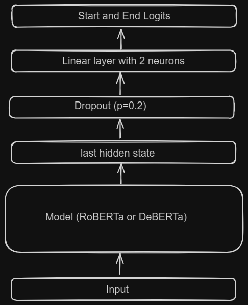

# [Protect Against Cyber Threats](https://machinehack.com/hackathons/shell_hackathon_to_protect_against_cyber_threats/overview)

This repository contains the solution for the hackathon, using this approach I was able to achieve <b>2nd rank</b> in this hackathon. 
Here is the [link](https://analyticsindiamag.com/from-data-defiance-to-cyber-resilience-the-winners-of-shells-cyber-threat-hackathon/) to my interview with [Analytics India Magazine](https://analyticsindiamag.com/).

## Notebook links
Training Notebook:  
Inference Notebook: 

## Problem Statement

Can you construct a next-gen model, capable of detecting code that is present in a body of text? Be part of a mission to enhance the security and resilience of web applications. 

Protecting our software landscapes is not an easy task. Malicious actors are frequently trying to enter systems and get access to resources, whether operational or data. The ability for an actor to compromise systems, elevate their privileges, and move laterally within infrastructure typically hinges on executing hidden code. One common method they employ is embedding this code in seemingly harmless media—whether it's images, videos, or even simple text files.

## Task
Given a body of text, find the source code hidden in the text. There might not be any source control or multiple sections of source code concealed within the text.

## Dataset
1. ID: A unique identifier, either an integer or string, used to distinguish each row in the dataset.
2. Text: A string containing the textual content associated with each record.
3. ContainsCode: A boolean indicating whether the "Text" field contains any code snippets.
4. CodeList: A list or array storing code snippets extracted from the "Text" field, if applicable.

## Approach
- I approached this problem as an NLP QA Task.
- I have finetuned [RoBERTa base distilled](https://huggingface.co/deepset/roberta-base-squad2-distilled) and [DeBERTa v3 large](https://huggingface.co/deepset/deberta-v3-base-squad2), each for 30 epochs.
- Both of these models were trained on SQUAD V2.
- For Inference, I use the output  of the model which has a higher logit score.
- Optimizer Adamw with Learning rate = 2e-5 and Cosine scheduler with warmup.
- Dropout of 0.2

## Model Architecture

## Metrics
- The evaluation metric used in this competition is accuracy.
- First, MultiLabel Binarizer is applied on the predicted span of code.
- Then, accuracy is computed.
- I achieved <b>Rank 13</b> with a socre of <b>0.90227</b> on private leaderboard.
- And after the final Round of the Hackathon, I was able to secure <b>2nd rank</b>.
